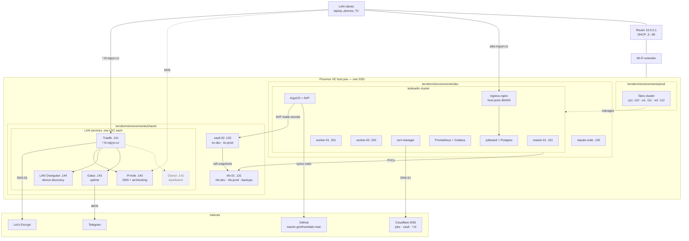

[](https://github.com/maxim-grin/homelab/actions/workflows/ci.yaml)

# homelab

A single-host Proxmox homelab run as code: Terraform provisions the VMs and
LXCs, Ansible configures them, and ArgoCD delivers applications to a
kubeadm Kubernetes cluster from this repository's `main`. Cluster secrets
stay in Vault and are resolved at sync time, TLS comes from Let's Encrypt over
DNS-01, and a row of small LXCs serves the LAN — DNS, a reverse proxy,
uptime alerts.



Solid boxes run today; dashed boxes are planned. Addresses are on
`10.0.0.0/24`, whose DHCP pool is `.2`–`.99`; every machine in the
diagram has a static address above that pool.

## What actually runs

| Layer      | What                                                                                                                                                                            | Where it is defined                                                                                     |
| ---------- | ------------------------------------------------------------------------------------------------------------------------------------------------------------------------------- | ------------------------------------------------------------------------------------------------------- |
| Hypervisor | Proxmox VE, node `pve`                                                                                                                                                          | not in git — see `docs/rebuild.md`                                                                      |
| VMs        | k8s master + 2 workers, `claude-code` workstation                                                                                                                               | `terraform/environments/dev`                                                                            |
| VM         | Talos prod cluster: one control plane and two workers, `.110`–`.112`; nodes only, no workloads yet                                                                              | `terraform/environments/prod`, `terraform/modules/talos-node`                                           |
| VM         | `nfs-01`, NFS for the dev cluster; its `nfs-prod` share is ready but unexported until prod has nodes                                                                            | `terraform/environments/shared`                                                                         |
| VM         | `vault-02`, the Vault VM; `kv-dev` in use, `kv-prod` ready but unused                                                                                                           | `terraform/environments/shared`                                                                         |
| LXCs       | `pihole` (DNS, ad blocking) at `.140`, `traefik` (`*.hl.mgryn.cc`) at `.141`, `gatus` (uptime, Telegram alerts) at `.143`, `orangutan` (device discovery) at `.144`; `glance` empty until its role lands | `terraform/environments/shared`, `ansible/roles/pihole`, `ansible/roles/traefik`, `ansible/roles/gatus`, `ansible/roles/orangutan` |
| OS config  | kubeadm cluster, containerd, NFS server and client                                                                                                                              | `ansible/`                                                                                              |
| GitOps     | ArgoCD (`argocd.mgryn.cc`), app-of-apps `root-dev`                                                                                                                              | `ansible/roles/argocd`, `argocd/environments/dev`                                                       |
| Ingress    | ingress-nginx, DaemonSet on host ports 80/443                                                                                                                                   | `argocd/apps/ingress-nginx`                                                                             |
| TLS        | cert-manager, Let's Encrypt via ACME DNS-01 through Cloudflare                                                                                                                  | `argocd/apps/cert-manager`, `argocd/apps/cert-manager-issuers`                                          |
| Storage    | NFS server VM exporting `/srv/nfs/k8s`, `nfs-dev` StorageClass                                                                                                                  | `ansible/roles/nfs_server`, `argocd/apps/nfs_provisioner`                                               |
| Apps       | monitoring (Prometheus + Grafana); jobboard, the owner's own web app, whose source is in a private repository — only its image, `ghcr.io/maxim-grin/jobboard`, is deployed here | `argocd/apps/`                                                                                          |
| Secrets    | Vault (`https://vault.mgryn.cc:8200`), VM `vault-02`; argocd-vault-plugin resolves `<path:...>` placeholders at sync time                                                       | `ansible/roles/vault`, `terraform/environments/shared`                                                  |

**Scope.** One physical machine, one SSD, two Kubernetes clusters: `dev`
(kubeadm, running the platform today) and `prod` (Talos, three nodes, no
workloads yet). `prod`'s ArgoCD and monitoring hub arrives in sub-project 3
of the [roadmap](docs/superpowers/specs/2026-09-26-homelab-roadmap-design.md)
([ADR 0012](docs/decisions/0012-hub-and-spoke-topology.md)). Glance, one LXC
reached as `home.hl.mgryn.cc`, comes next — see the
[LAN services design](docs/superpowers/specs/2026-09-27-lan-services-design.md).

**Rebuilding** after a disk replacement or a total loss starts at
[docs/rebuild.md](docs/rebuild.md), which lists what this repository does
_not_ contain — the part that will bite. Why things are built this way is in
[docs/decisions/](docs/decisions/), one ADR per decision. Running it day to
day — UIs, applying changes, shipping a jobboard version — is
[docs/operations.md](docs/operations.md).

## Names and TLS

`jobs.mgryn.cc`, `vault.mgryn.cc` and `*.hl.mgryn.cc` are the names in
public DNS: all three are DNS-only (grey cloud) Cloudflare records holding
a private IP, so any device on the LAN resolves them without a hosts
entry. Public DNS
answering with a private address is fine, though some routers drop it as
DNS-rebinding protection. `*.hl.mgryn.cc` → `10.0.0.141` covers
`pihole`, `proxmox`, `traefik`, `status` and `lan`; `vault.mgryn.cc` points
straight at `vault-02`. The other cluster names — `argocd`, `grafana`,
`prometheus` — resolve through `/etc/hosts` on the workstation. There is
no Cloudflare Tunnel.

`jobs.mgryn.cc` and `*.hl.mgryn.cc` are served over HTTPS with their own
Let's Encrypt certificate, obtained by ACME DNS-01, writing a TXT record
through the Cloudflare API — but by two different components with two
different tokens. `jobs.mgryn.cc`'s (and `grafana.mgryn.cc`'s) comes from
cert-manager, with a token held in
Vault at `kv-dev/cert-manager/cloudflare`; `*.hl.mgryn.cc`'s comes from
Traefik itself, with its own token in `secret.yaml`
(`traefik_cloudflare_api_token`) — kept separate so either can be revoked
without touching the other. Renewal is automatic, 30 days before expiry.
DNS-01 rather than HTTP-01, and not Cloudflare's own edge certificate —
see [ADR 0008](docs/decisions/0008-acme-dns01-not-http01.md).

## Layout

```txt
.github/          workflows/ci.yaml: the checks GitHub runs on every PR.
ansible/          Roles and playbooks. Inventory per environment, secrets in
                  an ansible-vault file.
argocd/           base/       AppProject
                  apps/       kustomize bases and dev overlays per app
                  environments/dev/applications/  Application CRs, synced by root-dev
terraform/        modules/    reusable ubuntu-vm, ubuntu-k8s, lxc, nfs-server,
                              vault-vm, talos-node
                  environments/dev/     the kubeadm cluster and claude-code
                  environments/shared/  nfs-01, vault-02, the LAN LXCs
                  environments/prod/    the Talos prod cluster
scripts/          check-manifests.sh (the CI manifests check, runnable
                  locally) and ad-hoc helpers.
docs/             rebuild.md, operations.md
                  decisions/   architecture decision records
                  superpowers/ design specs and implementation plans
```

## Checks before committing

```bash
# uv tool install takes one package per invocation, not a list
uv tool install pre-commit
uv tool install ansible-lint
pre-commit install                          # wires pre-commit AND commit-msg
```

The hooks: file hygiene, `check-yaml`, `detect-private-key`, `gitleaks`,
`ansible-lint`, `terraform fmt`, and two checks on the message: its
conventional-commit format, and `scripts/check-commit-msg.py` — subject
≤ 50 characters, body ≤ 72, no attribution lines. `ansible-lint` runs at
profile `production` with no ignore file, so any finding fails — see
[ADR 0009](docs/decisions/0009-ci-reads-only-lint-blocks.md) for why. It
needs the collections pinned in
`ansible/requirements.yml` (`ansible-galaxy collection install -r
ansible/requirements.yml`), and so do the playbooks themselves.

### CI

GitHub Actions (`.github/workflows/ci.yaml`) runs on every pull request and
every push to `main`. Nothing in it touches the cluster, Proxmox or any
secret; it only reads. Four jobs, in parallel:

| Job          | What it runs                                                                                                                                                                                                                                                   |
| ------------ | -------------------------------------------------------------------------------------------------------------------------------------------------------------------------------------------------------------------------------------------------------------- |
| `pre-commit` | `pre-commit run --all-files` — the same hooks as above — plus a full-history `gitleaks` scan (the hook itself only scans staged changes)                                                                                                                       |
| `commits`    | the conventional-commit hook over every non-merge commit in the PR (PRs only)                                                                                                                                                                                  |
| `terraform`  | `terraform init -backend=false`, `validate` and `tflint` in `terraform/environments/dev`, `terraform/environments/shared` and `terraform/environments/prod`                                                                                                                                   |
| `manifests`  | `scripts/check-manifests.sh`: `kustomize build` of every kustomization, `helm template` of every Helm chart in the Application CRs, `kubeconform -strict` on the output (`CustomResourceDefinition` objects are skipped: no schema is published for that kind) |

Run the `manifests` job locally with `scripts/check-manifests.sh`. It needs
`kustomize`, `helm`, `yq` (mikefarah v4) and `kubeconform` on `PATH`. `<path:...>`
placeholders are checked as plain strings; nothing resolves them against Vault.

See `ansible/README.md` and `terraform/README.md` for the detail of each half.
