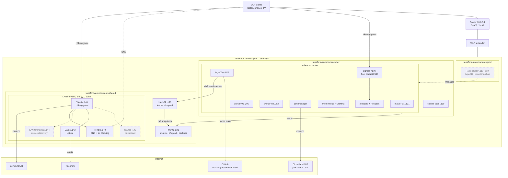

[](https://github.com/maxim-grin/homelab/actions/workflows/ci.yaml)

# homelab

Bare-metal Proxmox homelab: VMs provisioned with Terraform, configured with
Ansible, and applications delivered to Kubernetes by ArgoCD.

Everything here describes one physical machine and the `dev` environment on it. There is no
second host and no `prod` cluster; the `prod/` directories are scaffolding not yet implemented.

**If you are rebuilding after a disk replacement or a total loss, start at
[docs/rebuild.md](docs/rebuild.md).** It lists what this repository does
_not_ contain, which is the part that will bite.

Why things are built this way is recorded in
[docs/decisions/](docs/decisions/), one ADR per decision.

## What actually runs

| Layer      | What                                                           | Where it is defined                                       |
| ---------- | -------------------------------------------------------------- | --------------------------------------------------------- |
| Hypervisor | Proxmox VE, node `pve`                                         | not in git — see `docs/rebuild.md`                        |
| VMs        | k8s master + 2 workers, `claude-code` workstation              | `terraform/environments/dev`                                |
| VM         | `nfs-01`, serving both dev and prod                            | `terraform/environments/shared`                              |
| VM         | `vault-02`, the Vault VM                                        | `terraform/environments/shared`                              |
| LXCs       | `pihole` (DNS, ad blocking) at `.140`, `traefik` (`*.hl.mgryn.cc`) at `.141`, `gatus` (uptime, Telegram alerts) at `.143`; the rest empty until their roles land | `terraform/environments/shared`, `ansible/roles/pihole`, `ansible/roles/traefik`, `ansible/roles/gatus` |
| OS config  | kubeadm cluster, containerd, NFS server and client             | `ansible/`                                                |
| GitOps     | ArgoCD (`argocd.mgryn.cc`), app-of-apps `root-dev`              | `ansible/roles/argocd`, `argocd/environments/dev`         |
| Ingress    | ingress-nginx, DaemonSet on host ports 80/443                  | `argocd/apps/ingress-nginx`                               |
| TLS        | cert-manager, Let's Encrypt via ACME DNS-01 through Cloudflare | `argocd/apps/cert-manager`, `argocd/apps/cert-manager-issuers` |
| Storage    | NFS server VM exporting `/srv/nfs/k8s`, `nfs-dev` StorageClass | `ansible/roles/nfs_server`, `argocd/apps/nfs_provisioner` |
| Apps       | monitoring (Prometheus + Grafana), jobboard                    | `argocd/apps/`                                            |
| Secrets    | Vault (`https://vault.mgryn.cc:8200`), VM `vault-02`; argocd-vault-plugin resolves `<path:...>` placeholders at sync time | `ansible/roles/vault`, `terraform/environments/shared` |

Most hostnames resolve through `/etc/hosts` on the workstation, pointing at
a node IP since ingress-nginx answers on every node; `vault.mgryn.cc` is the
exception and points straight at `vault-02`. There is no Cloudflare Tunnel.

**Planned, not yet running:** Glance and LAN Orangutan,
one LXC each in `terraform/environments/shared`, reached as
`*.hl.mgryn.cc` — see the
[LAN services design](docs/superpowers/specs/2026-09-27-lan-services-design.md).
After them, a Talos prod cluster that runs ArgoCD and monitoring for both
clusters — see the
[roadmap](docs/superpowers/specs/2026-09-26-homelab-roadmap-design.md).

`pihole.hl.mgryn.cc`, `proxmox.hl.mgryn.cc`, `traefik.hl.mgryn.cc` and
`status.hl.mgryn.cc` resolve on any LAN device through a Cloudflare
DNS-only wildcard record, `*.hl.mgryn.cc` → `10.0.0.141`.

## Diagram

Solid boxes run today; dashed boxes are planned. Addresses are on
`10.0.0.0/24`, whose DHCP pool is `.2`–`.99`; everything below has a
static address above it.



`jobs.mgryn.cc` and `*.hl.mgryn.cc` are the two names in public DNS: both
are DNS-only (grey cloud) Cloudflare records holding a node IP, so any
device on the LAN resolves them without a hosts entry. Public DNS
answering with a private address is fine, though some routers drop it as
DNS-rebinding protection. Both are also served over HTTPS — see TLS,
below.

## TLS

`jobs.mgryn.cc` and `*.hl.mgryn.cc` are each served over HTTPS with their
own Let's Encrypt certificate, obtained by ACME DNS-01, writing a TXT
record through the Cloudflare API — but by two different components with
two different tokens. `jobs.mgryn.cc`'s comes from cert-manager, with a
token held in Vault at `kv-dev/cert-manager/cloudflare`; `*.hl.mgryn.cc`'s
comes from Traefik itself, with its own token in `secret.yaml`
(`traefik_cloudflare_api_token`) — kept separate so either can be revoked
without touching the other. Renewal is automatic, 30 days before expiry.

DNS-01 rather than HTTP-01, and not Cloudflare's own edge certificate for
`mgryn.cc` — see [ADR 0008](docs/decisions/0008-acme-dns01-not-http01.md)
for why.

Two issuers exist — `letsencrypt-prod` and `letsencrypt-staging`. If
issuance breaks, point the Ingress annotation at staging while debugging.
Staging certificates are untrusted, so the browser warns, but production
allows only 5 failed validations per hostname per hour and 50 certificates
per domain per week.

```bash
kubectl -n jobboard describe certificate jobboard-tls
kubectl -n jobboard get order,challenge
```

## jobboard image version

`argocd/apps/jobboard/dev/kustomization.yaml` names the published version to
run; `argocd/apps/jobboard/base/app-deployment.yaml` carries no tag. Deploying
a new build is one line:

```
newTag: "0.2.0"
```

commit, and merge it through a pull request. The pod spec genuinely changes,
so ArgoCD rolls it on the next poll — no `kubectl rollout restart`. Rolling
back is the same edit with the previous number — see
[ADR 0007](docs/decisions/0007-pin-image-tags-not-latest.md) for why that
did not use to work.

The app repository publishes `ghcr.io/maxim-grin/jobboard:<version>` only when
a `v<version>` git tag is pushed there. Naming a version here that has not been
published yet gives `ImagePullBackOff` until it is — loud and self-correcting.

## Layout

```txt
.github/          workflows/ci.yaml: the checks GitHub runs on every PR.
ansible/          Roles and playbooks. Inventory per environment, secrets in
                  an ansible-vault file. roles/vault/ installs and seeds
                  HashiCorp Vault.
argocd/           base/       AppProject
                  apps/       kustomize bases and dev overlays per app
                  environments/dev/applications/  Application CRs, synced by root-dev
terraform/        modules/    reusable ubuntu-vm, ubuntu-k8s, lxc, talos-*
                  environments/dev/  the machines that exist
talos/            Unused. Templates for a Talos cluster that was never built.
scripts/          check-manifests.sh (the CI manifests check, runnable locally) and ad-hoc helpers.
docs/rebuild.md   How to recreate all of this from a bare Proxmox install.
```

## Checks before committing

```bash
# uv tool install takes one package per invocation, not a list
uv tool install pre-commit
uv tool install ansible-lint
pre-commit install                          # wires pre-commit AND commit-msg
```

The hooks: file hygiene, `check-yaml`, `detect-private-key`, `gitleaks`,
`ansible-lint`, `terraform fmt`, and two checks on the message: its
conventional-commit format, and `scripts/check-commit-msg.py` — subject
≤ 50 characters, body ≤ 72, no attribution lines. `ansible-lint` runs at
profile `production` with no ignore file, so any finding fails — see
[ADR 0009](docs/decisions/0009-ci-reads-only-lint-blocks.md) for why. It
needs the collections pinned in
`ansible/requirements.yml` (`ansible-galaxy collection install -r
ansible/requirements.yml`), and so do the playbooks themselves.

### CI

GitHub Actions (`.github/workflows/ci.yaml`) runs on every pull request and
every push to `main`. Nothing in it touches the cluster, Proxmox or any
secret; it only reads. Four jobs, in parallel:

| Job          | What it runs                                                                                                                                                                                                                                                   |
| ------------ | -------------------------------------------------------------------------------------------------------------------------------------------------------------------------------------------------------------------------------------------------------------- |
| `pre-commit` | `pre-commit run --all-files` — the same hooks as above — plus a full-history `gitleaks` scan (the hook itself only scans staged changes)                                                                                                                       |
| `commits`    | the conventional-commit hook over every non-merge commit in the PR (PRs only)                                                                                                                                                                                  |
| `terraform`  | `terraform init -backend=false`, `validate` and `tflint` in `terraform/environments/dev`                                                                                                                                                                       |
| `manifests`  | `scripts/check-manifests.sh`: `kustomize build` of every kustomization, `helm template` of every Helm chart in the Application CRs, `kubeconform -strict` on the output (`CustomResourceDefinition` objects are skipped: no schema is published for that kind) |

Run the `manifests` job locally with `scripts/check-manifests.sh`. It needs
`kustomize`, `helm`, `yq` (mikefarah v4) and `kubeconform` on `PATH`. `<path:...>`
placeholders are checked as plain strings; nothing resolves them against Vault.

**Branch protection.** CI only blocks a merge once the four checks are
required. That is a repository setting, not a file in git. Suggested rules
for `main`: pull request required with 0 approvals (you cannot approve your
own PR), the four checks required, "up to date" not required, force-push and
deletion blocked, no bypass. Enable it _after_ `main` is green, or it blocks
the PR that fixes it. A check name only appears in the picker once it has run
once. From the UI: Settings → Rules → Rulesets → New branch ruleset. Or, as a
repo admin:

```bash
gh api -X POST repos/maxim-grin/homelab/rulesets --input - <<'EOF'
{
  "name": "protect main",
  "target": "branch",
  "enforcement": "active",
  "bypass_actors": [],
  "conditions": { "ref_name": { "include": ["~DEFAULT_BRANCH"], "exclude": [] } },
  "rules": [
    { "type": "deletion" },
    { "type": "non_fast_forward" },
    { "type": "pull_request", "parameters": {
        "required_approving_review_count": 0,
        "dismiss_stale_reviews_on_push": false,
        "require_code_owner_review": false,
        "require_last_push_approval": false,
        "required_review_thread_resolution": false } },
    { "type": "required_status_checks", "parameters": {
        "strict_required_status_checks_policy": false,
        "required_status_checks": [
          { "context": "pre-commit" }, { "context": "commits" },
          { "context": "terraform" }, { "context": "manifests" } ] } }
  ]
}
EOF
```

If `gh` returns 403, run `gh auth status`: a `GH_TOKEN` in the environment
overrides the logged-in account. To check it works, open a throwaway PR with
a trailing space in a file: `pre-commit` should go red and merge should be
blocked.

## Day-to-day

```bash
# provision or change VMs
cd terraform/environments/dev
terraform apply -var-file=dev.tfvars

# configure them
cd ansible
ansible-playbook playbooks/site.yaml -e @secret.yaml --ask-vault-pass

# applications deploy themselves: ArgoCD syncs main from GitHub, so a change
# is live once its pull request merges, not once it is committed or pushed
git push -u origin <branch>
gh pr create --base main --fill
```

jobboard: `https://jobs.mgryn.cc` -- the only name with TLS; HTTP 308s to it
ArgoCD UI: `http://argocd.mgryn.cc`
Grafana: `http://grafana.mgryn.cc`
Prometheus: `http://prometheus.mgryn.cc` (no authentication -- Prometheus ships none)
Vault UI: `https://vault.mgryn.cc:8200` -- straight to `vault-02`, not through
ingress-nginx, so it is reachable even when the cluster is down

See `ansible/README.md` and `terraform/README.md` for the detail of each half.
